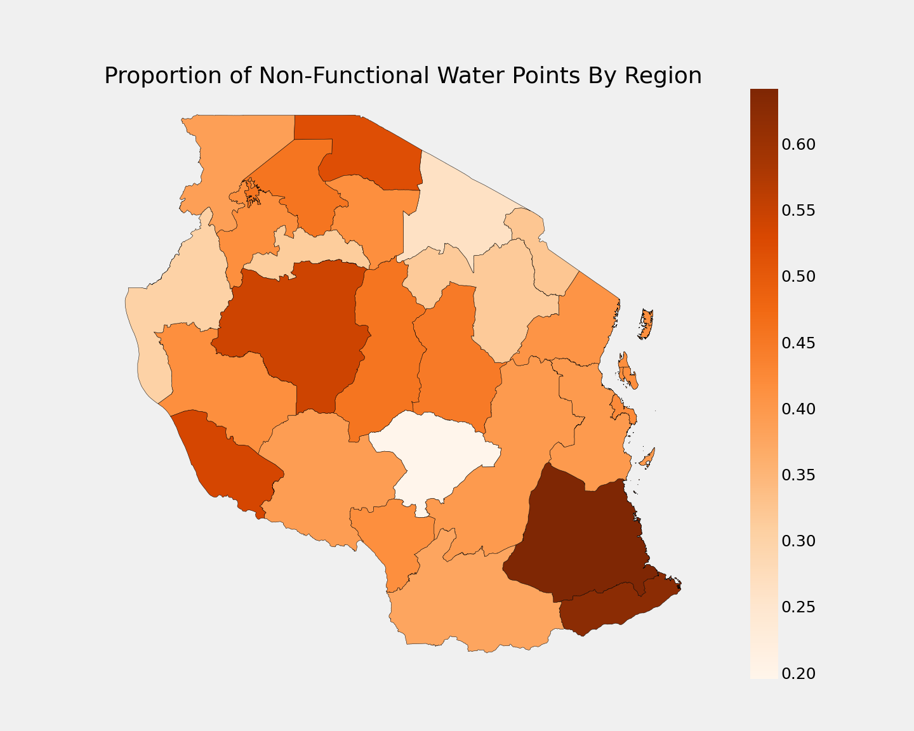
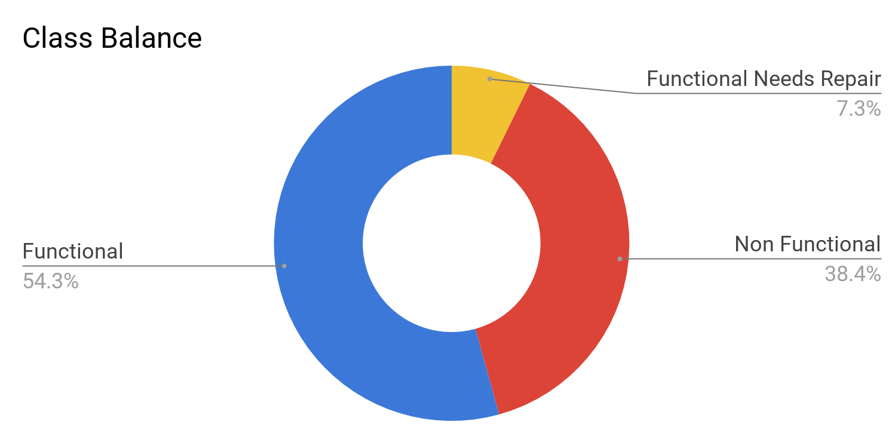
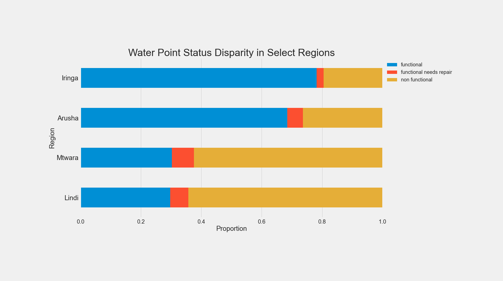

# Tanzania Well Classification
A classification project using the [Tanzania Water Well Data](https://www.drivendata.org/competitions/7/pump-it-up-data-mining-the-water-table/page/23/) from Driven Data.

     
## Our Goal
Our goal is to provide a way for water providers in Tanzania to predict the status of water wells. [Tanzania has struggled](https://water.org/our-impact/where-we-work/tanzania/) to provide water to it's citizens and needs to change its approach to water infrastructure. Our tool could provide insights into what needs to be done to overcome this challenge. 

## Objectives
>Using data from Taarifa and the Tanzanian Ministry of Water, can you predict which pumps are functional, which need some repairs, and which don't work at all?  

<i>-DRIVENDATA Project Description</i>

    

#### Modelling
 The Tanzanian government is struggling to provide water to its growing population. Providing insights into the future status of their water infrastructure will enable them to prepare for future water demands. Our hope in making this model is to provide the government a way to predict the statuses of these points and allocate resource to areas in need based on these predicitons.

#### Business Understanding
Furthermore, we are attempting to find out exactly which features best determine this functioning status. Numerous studies have been done on what factors contribute to a wells longevity which have found that the management style, location, and technology are all strong indicators. We want to verify this in our data and also find more factors that are accessible given the format of the data.

    

## Measure of Success
In order for our model to be effective, we will be seeking to minimize false negatives. In the context of our model, a false negative would be identifying a water-point as functional when it is in fact non-functional. This is a problem because we don't want to write off non-functional wells and leave people without access to water. False positives are not as much of an issue, because falsely identifying a well as non-functional will only result in an unnecessary maintenance call. For this reason, we will seek to maximize our model's recall score.

### Methods Used
* Inferential Statistics
* Machine Learning
* Data Visualization
* Predictive Modeling
* Classification

### Technologies
- Python
    - Pandas
    - SKLearn
    - NumPy
    - GeoPandas
    - MatPlotLib
    - XGBoost
- Jupyter
- Anaconda

## Getting Started
1. Download data from the [Driven Data Competition Page](https://www.drivendata.org/competitions/7/pump-it-up-data-mining-the-water-table/data/)
    - You need to create a Driven Data account (it's free) and sign up for [this](https://www.drivendata.org/competitions/7/pump-it-up-data-mining-the-water-table/) competition.

2. Explore the data

    a. Follow the process_data notebook in this projects 'notebook' folder and explore the processed data.

    b. Create your own EDA notebook, import the raw data files and explore the unprocessed data.

## Featured Notebooks/Analysis/Deliverables

#### Members:

|         Name             |                  GitHub               | 
|--------------------------|----------------------------------|
|Syd Rothman               |  [sydroth](https://github.com/sydroth)|
|Jacob Prebys              | [jprebys](https://github.com/jprebys)|
|Jason Wong                | [jwong853](https://github.com/jwong853)|
|Maximilian Esterhammer-Fic| [mesterhammerfic](https://github.com/mesterhammerfic)|
